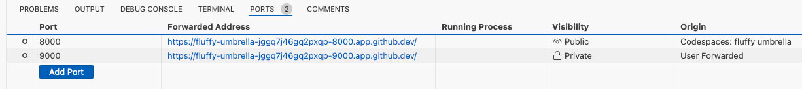

[//]: # (README.md)
[//]: # (Copyright © 2024 Joel A Mussman. All rights reserved.)
[//]: #


# LambdaOne-AWS-Python

## Synopsis

LambdaOne is a simple AWS lambda project with the goal of:

* Providing a template building an AWS Lambda function using Python locally
* ***Using a third-party identity provider (IdP) for authorization***
* Explore logging in an AWS Lambda function
* Demonstrating local unit and integration testing, especially the dificulties of mocking class definitions
* Build a deployable Lambda using either a container or zip file

This project was created as an example if you prefer to use Python to achieve these goals.
If you are looking for a comparison of Python vs JavaScript vs anything else you can find arguments for each in every direction you look.
Here is an article which claims the Python duration is about 30% less than NodeJS: https://antonputra.com/python/python-vs-nodejs-benchmark/#performance-benchmark,
and that performance is saving money using AWS.
On the other hand, this article argues that NodeJS deploys smaller packages because of more concise shared resources, and that is a clear
savings because AWS charges for space too: https://betterdev.blog/aws-lambda-runtime-nodejs-python/.
Obviously if you are not decided you have a choice to make, and your choice may depend on your own study of your own problem domain.

### Building an AWS Lambda locally with Python
Start with the [AWS Lambda](https://docs.aws.amazon.com/lambda/) documentation and the
[Developer Guide](https://docs.aws.amazon.com/lambda/latest/dg/welcome.html), but
almost nobody uses the embedded editor because developers rarely have access to deploy labda functions.
Information about building functions is farther along along the page, not necessarily obvious under "Configuring Functions".
There are two paths, one for [containers](https://docs.aws.amazon.com/lambda/latest/dg/images-create.html)
and the other for deploying [zp files](https://docs.aws.amazon.com/lambda/latest/dg/configuration-function-zip.html).

This project provides a well defined structure for setting up the lambda code, performing both unit and integration tests,
and integrating third-party identity.
The lambda is very simple, simplying returning a line of of text.

The Boto3 library onbly supports AWS as the IdP for the application to the lambda authorization.
This project addresses using a more robust, third-party IdP for customer identity.
THis could be someline like Otka CIC (formally Auth0) for customer identity,
or for internal applications perhaps a workforce identity product such as Okta WIC.

A full set of example unit and integration tests are provided that cover
both the lambda function and the authorization code.
Deployment of lambda functions is normally the responsibility of the cloud administrators, not the developers, so
it is necessary as developers to have a full set of tests that make sure the project is robust and will work when deployed.
These tests are also necessary for performing regression testing
when new features are added or issues are fixed.

The Lambda Development Project section will explore how to build, test, and extend the template, and the
[Deploy to AWS](#deploy-to-aws) section below will address deployment using Docker or a zip file.

## Lambda Development Project Template

This section explores the layout of the project, the features, and how to test it.
The ulitmate goal is to build on this project as a template for real-world functions.

### Project Layout

The project layout is visible in the repository before setting up the project, so it is addressed first.

To start, AWS Lambda requires that the entry function be at the top of the task folder.
It is not possible to move this, but it may be named anything that you like.
If a more complex lambda scenario is decomposed into multiple files, place the remaining code under an appropriate package name
at the top level.
In this example, the main entry point is *lambda_function.py*, and the additional concerns
are separated into files under the *lambdaone* package.
The tests occupy a parallel structure under *test*.
Separating the tests makes it simpler to exclude them from the deployment container or zip file:

```
lambda_function.py
lambdaone/
    authz.py
    fixed_key.py
    hello_world.py
    jwt_key.py
test/
    integration/
        test_lambda_function.py
    unit/
        test_lambda_function.py
        test_lambdaone/
            test_authz.py
            test_fixed_key.py
            test_hello_world.py
            test_jwt_key.py
````

### Initializing the local development environment.

If you prefer, development may also be done in a [GitHub Codespaces](#run-the-tests-in-github-codespaces) environment, which is discussed in the next section.

The requirements for local development are:

* Python 3.8 or later; any distribution, e.g. Anaconda, should be fine.
The project was built and tested with Python 3.12.2 via Anaconda.
* Visual Studio Code
    * Add the Microsoft "Python extension for Visual Studio Code".
    This should also add the Microsoft "Python Debugger extension for Visual Studio Code", but
    if it does not make sure this is added too.
* Docker, if it is required to run and/or test the project in a Docker container, and for deployment as a conmtainer. 
If you are using Microsoft Windows, MacOS, or Linux locally, consider installing [Docker Desktop](https://www.docker.com/products/docker-desktop/).
* AWS CLI, if it is required to deploy the project.
* Zip (Winzip, etc.) if it is required to deploy the project as a zip file.

#### Instructions

1. Clone this project locally with *get clone [git@github.com:jmussman/lambdaone-aws-python.git](it@github.com:jmussman/lambdaone-aws-python.git)*.
1. Open the project in VS Code.
1. Open an integrated terminal with with View &rarr; Terminal.
Create a virtual python environment from the terminal.
The folder name .venv is important. The $ is the command prompt:
    ```
    $ python -m venv .venv
    ```
1. Open the command palette with View &rarr; Command Palette...
Seach for *Python: Select Interpreter* and click on it.
Pick the python in the .venv folder, e.g. *Python 3.12.2 ('.venv') ./.venv/bin/python*.

1. Recommended: open VS Code settings, search for *Python Terminal Activate Environment*, and make sure it is checked.
It should be checked by default.
This will run the virtual environment activation script in each terminal window opened, which is necessary for the *Run and Debug* panel commands.
1. There are two sets of module requirements for the project, one for production and a second one with development dependencies.
Install both of these to the virtual environment (./.venv/lib) with pip at the command line:
    ```
    $ pip install -r requirements.txt
    $ pip install -r devrequirements.txt
    ```
1. The environment is ready to begin development or run the existing tests.
Skip over the next section on *GitHub Codespaces* and continue with [*Tests*](#tests).

#### Run the project in GitHub Codespaces

The button will replace the repository page in this tab with the Codespace, so read all the instructions first!

[](https://github.com/codespaces/new?hide_repo_select=true&ref=main&repo=858797673) 

Click the button above (after reading the instructions) to open the project in GitHub Codespaces.
On the project configuration page presented click the *Create codespace* button to proceed.
The codespace will go through several initialization steps.

This README.md file will be displayed in the container, when it appears find this section to continue with the instructions.

After the README.md file is displayed, a terminal window named *Codespace* will open automatically as a container
to run the script which finishes installation.

When the *pip* commands launched by the script finish in that terminal a command prompt will appear, and
it will be safe to close the terminal and start working with the project.

#### Tests

Open the VS Code *Run and Debug* panel from the toolbar and execute either of the tasks "*All Tests*" or "*Coverage All Tests*".
A new terminal window named *Python* will open to display the resultsof the tests.
If code coverage is selected, the report will open in its own terminal window.

There are two test patterns used in the project that may be of interest to help write your own tests:

##### Integration Tests with Live Servers

The integration test for *lambda_function, test_lambda_function.py*, requires a
JWKS endpoint at an authorization server to provide the public signing keys in JSON format.
This is handled internally in the test fixture by creating a Python HTTP server with a SimpleHTTPRequestHandler for the requests that serves files from
the test/resources folder.
The hardwired JSON key is in the resources folder.
The server starts when the test class is loaded, and is shut down when the test class ends.

##### Acceptance Tests with Docker

First, strip the ".disabled" extension from the test/acceptance/test_lambda_function.py.disabled file.

##### Hoisting Class Definitions for Import Styles

*test_jwt_key* includes an example of mocking out a class definition.
The *jwt_key* module uses the *jwt.jwks_client.PyJWKClient* class to retrieve the JWKS
public keys from the IdP.
The problem is there are three ways the class could be referenced by the code under test (CUT).
The class is referenced in two places and can be used with a full qualified name from either
location: jwt.jwks_client.PyJWKClient or jwt.PyJWKClient.
The third way is for the CUT could load the class as a property using the form
"from jwt.jwks_client import PyJWKClient" or "from jwt import PYJWKClient".
In that case the reference to the class becomes a property of jwt_key.

To perform an opqaue-view test both of the references in the *jwt* module must be mocked, along
with the property that could be imported into jwt_key.
The *setUpClass* method in *test_jwt* mocks the two references, and then hoists them above the
import in the *jwt_key* module by reloading the module, causing the class reference to be reloaded in that module.
The setup method preserves the reference to the original class definition, and in the *teearDownClass* method
the original reference is put back and and both the *jwt* and *jwt_key* modules are reloaded to reset them.

#### Extending the template and using third-party authorization

One of the goals is for authorization from another IdP, such as Okta CIC (formally Auth0).
The *.env* file contains the externalized configuration for the authorization server, e.g.:

```
AUDIENCE=https://treasure
ISSUER=https://pid.pyrates.live
JWKSPATH=https://pid.pyrates.live/oauth2/v1/keys
REQUIRE=treasure:read
SIGNATUREKEYPATH=public.pem
```

Authorization from a JSON Web Token (JWT) will only be performed by the lambda if the *REQUIRE* property is set to
one or more scopes.
Separate multiple scopes with commas (spaces are allowed).

When authorization is used, the token granting those scopes must be sent as the authorization header property in
the HTTP request in the form of a bearer token:

```
authorization: bearer <token string>.
```

When tokens are used, the *AUDIENCE* and *ISSUER* properties must match what the IdP is expected to include in the JWT.

If the signatures are to be obtained with JWKS, the *JWKSPATH* property must be the URI of the JWKS endpoint at the authorization server.
The parallel *SIGNATUREKEYPATH* property references a local file for a PEM format key.
Because AWS Lambda requires that all the files be at the top of
the Docker image, that is where it must be placed and it always be just a file name.

The signature key path and the JWKS path are mutually exclusive, and the jwt_key module will refuse a configuration with both.

There are many reasons to consider using a third-party identity provider, one of which the focus is entirely
on the IdP, the configuration and branding are much more adaptable, and the administration is much easier to work with in production. 
Configuring a real authorization server is really outside the scope of this document, but as a starting
point you may register for a free Okta CIC developer tenant to play with by clicking the *Sign up* button at https://developer.auth0.com.
Once you have a tenant, you need to configure an API integration with the scopes that the lambda will expect (https://auth0.com/docs/get-started/apis),
configure an application that authenticates against this IdP and receives an access token
to call the lambda with (https://auth0.com/docs/get-started), and of course configure the .env file properly with the audience, issuer, require, and jwkspath.

If the *REQUIRE* property is not set, a token is not required for the lambda to return a value.

#### Testing against a Docker container

The project is set up to build and deploy to a Docker container to make sure it is accessible and runs in that environment.
Docker is not included in the integration tests because it may not be possible to use in a local environment.
Also, not everyone will build and deploy a Docker image; an alternative is to make a zip file from the project and deploy that.

If you have Docker installed, or you are running in a Codespace (which has dockerd installed), run the application using the following steps.
These instructions are more precise than those in the AWS documentation:

1. Make sure that Docker is running.
In Codespace Docker is included and will already be started.
This is verifiable in the terminal on any operating system with the command *docker ps*. The $ is the command prompt:
    ```shell
    $ docker ps
    ```
1. Build the docker image.
    Note that this image name differes from the AWS documentation:
    ```shell
    $ docker build --platform linux/amd64 -t lambdaone-image:test .
    ```
1. Build and run the Docker image from the product:
    ```shell
    $ docker run --platform linux/amd64 -p 9000:8080 lambdaone-image:test
    ```
1. The lambda function is not set up for a GET call from a web browser.
The Docker image is set up so the port is forwarded to port 9000 on localhost.
Use the *curl* command (in Windows PowerShell, MacOS, Linux) to make the call and check the results:
    ```shell
    $ curl -w "\n" "http://localhost:9000/2015-03-31/functions/function/invocations" -d '{}'
    ```
1. The Codespace is forwarding port 9000 to an external port on the Internet, the URL for this
    may be found under the "PORTS" tab in VS Code (the generated name in each Codespace will differ):

    
    
    Once the port forward URL is known construct and run a curl command outside the Codespace from the using port forward URL and the lambda URL:
    ```shell
    $ curl -w "\n" "<codespace port forward URL>/2015-03-31/functions/function/invocations" -d '{}'
    ```
1. Get the container ID from Docker:
    ```
    docker ps
    ```
1. Once the container ID is known, terminate the container:
    ```
    docker kill <container ID>
    ```
1. The following steps are not addressed in the AWS documentation. After terminating the container, destroy it:
    ```
    docker container rm <container ID>
    ```
1. If the Docker image will be modified and rebuilt the current one must be removed:
    1. Find the ID of the Docker image:
        ```
        docker images
        ```
    1. Delete the docker image:
        ```
        docker image rm <image ID>
        ```

## Deploy to AWS

### Building and deploying a container

The advantage of a container deployment is the image may locally be tested in Docker.

This project originates from the [AWS Base Image for Lambda](https://docs.aws.amazon.com/lambda/latest/dg/python-image.html#python-image-instructions).
There is not much point in repeating the details for deployement,
they can be found on the [Create a Lambda function using a container image](https://docs.aws.amazon.com/lambda/latest/dg/images-create.html#runtimes-images-lp) page.
[Deploy Python Lambda functions with container images](https://docs.aws.amazon.com/lambda/latest/dg/python-image.html) also reiterates the requirements,
covers building the application, the Dockerfile, using Docker to build and test the docker image, and most importantly,
connecting to and deploying the Docker project to AWS.

Working from those instructions, everything left to do is under
[Using an AWS base image for Python](https://docs.aws.amazon.com/lambda/latest/dg/python-image.html#python-image-instructions)/Deploying the Image.
These instrucitons are more precise than the AWS instructions, for example they forgot to fix the region name in the docker command:

1. Using AWS CLI Authenticate to your Amazon ECR registry and link that to Docker. $ is the command prompt:
    ```shell
    $ aws ecr get-login-password --region <AWS region name> | docker login --username AWS --password-stdin <AWS account ID>.dkr.ecr.<AWS region name>.amazonaws.com
    ```

1. Create a repository in Amazon ECR, in the same region of course:
    ```shell
    $ aws ecr create-repository --repository-name lambdaone --region <AWS region name> --image-scanning-configuration scanOnPush=true --image-tag-mutability MUTABLE
    ```

1. Copy the *repositoryUri* from the output you see.
Not from this example, but should look something like this:
    ```json
    {
        "repository": {
            "repositoryArn": "arn:aws:ecr:us-east-1:111122223333:repository/lambdaone",
            "registryId": "111122223333",
            "repositoryName": "hello-world",
            "repositoryUri": "111122223333.dkr.ecr.us-east-1.amazonaws.com/lambdaone",
            "createdAt": "2023-03-09T10:39:01+00:00",
            "imageTagMutability": "MUTABLE",
            "imageScanningConfiguration": {
                "scanOnPush": true
            },
            "encryptionConfiguration": {
                "encryptionType": "AES256"
            }
        }
    }
    ```

1. Tag your local Docker image into the Amazon ECR respository:
    ```shell
    $ docker tag lambdaone-image:test <repositoryUri>:latest
    ```

1. Deploy from Docker to Amazon ECR:
    ```shell
    $ docker push <repositoryUri>:latest
    ```

1. If one does not exist, create an execution role at AWS for the lambda function:
    ```shell
    $ aws iam create-role \
    --role-name lambda-ex \
    --assume-role-policy-document '{"Version": "2012-10-17","Statement": [{ "Effect": "Allow", "Principal": {"Service": "lambda.amazonaws.com"}, "Action": "sts:AssumeRole"}]}'
    ```

1. Create the lambda function at AWS. Replace the *repositoryUri* placeholder:
    ```shell
    $ aws lambda create-function \
    --function-name hello-world \
    --package-type Image \
    --code ImageUri=<repositoryUri>:latest \
    --role arn:aws:iam::<your ID>>:role/lambda-ex
    ```

1. Invoke the lambda function at AWS. The output will be written into the response.json file:
    ```shell
    $ aws lambda invoke --function-name lambdaone response.json
    ```

To update the function with a new version, rebuild the Docker image, upload it to the ECR repository, and call update-function-code:

```shell
$ docker build --platform linux/amd64 -t lambdaone-image:test .
$ docker push <repositoryUri>:latest
$ aws lambda update-function-code \
--function-name lambdaone \
--image-uri <repositoryUri>:latest \
--publish
```

### Building and deploying a zip file

A zip file is the simplest form of deploying a lambda function to AWS.

The base image is irrelevant if a zip file will be used for deployment; only the code is necessary.
[Working with .zip file archives for Python Lambda functions](https://docs.aws.amazon.com/lambda/latest/dg/python-package.html) provides
the details of putting the deployment together.
Generally follow the instrucitons under the subheading *To create the deployment package (virtual environment)*.

Per the instructions the packages in requirements.txt but be included at the root of the zip file.
The virtual environment is already created (and activated) in this project as *.venv*, and pip installed modules to *.venv/lib*.

1. Skip the instructions about creating the virtual environment, installing the packages,
locating the packages, and deactivating the virtual environment (steps 1 - 4 in the AWS instructions).

1. Add the installed Python packages into the zip archive:
    ```shell
    $ cd .venv/lib
    $ zip -r ../../lambdaone_deployment.zip .
    ```

1. Add the lambda function and submodules to the zip file:
    ```shell
    $ cd ../..
    $ zip lambdaone_deployment.zip lambda_function.py lambdaone
    ```

1. The AWS instructions skip creating the execution role, this is how it is done:
    ```shell
    $ aws iam create-role \
    --role-name lambda-ex \
    --assume-role-policy-document '{"Version": "2012-10-17","Statement": [{ "Effect": "Allow", "Principal": {"Service": "lambda.amazonaws.com"}, "Action": "sts:AssumeRole"}]}'
    ```

1. Create an AWS lambda function from the zip file:
    ```shell
    $ aws lambda create-function --function-name lambdaone \
    --runtime python3.12 --handler lambda_function.handler \
    --role arn:aws:iam::<AWS Account ID>:role/service-role/lambda-ex \
    --zip-file fileb://lambdaone_deployment.zip
    ```

1. To update the lambda function after changes, rezip the project contents and execute:
    ```shell
    $ aws lambda update-function-code --function-name lambdaone \
    --zip-file fileb://lambda_deployment.zip
    ```

## License

The code is licensed under the MIT license. You may use and modify all or part of it as you choose, as long as attribution to the source is provided per the license. See the details in the [license file](./LICENSE.md) or at the [Open Source Initiative](https://opensource.org/licenses/MIT).


<hr>
Copyright © 2024 Joel A Mussman. All rights reserved.